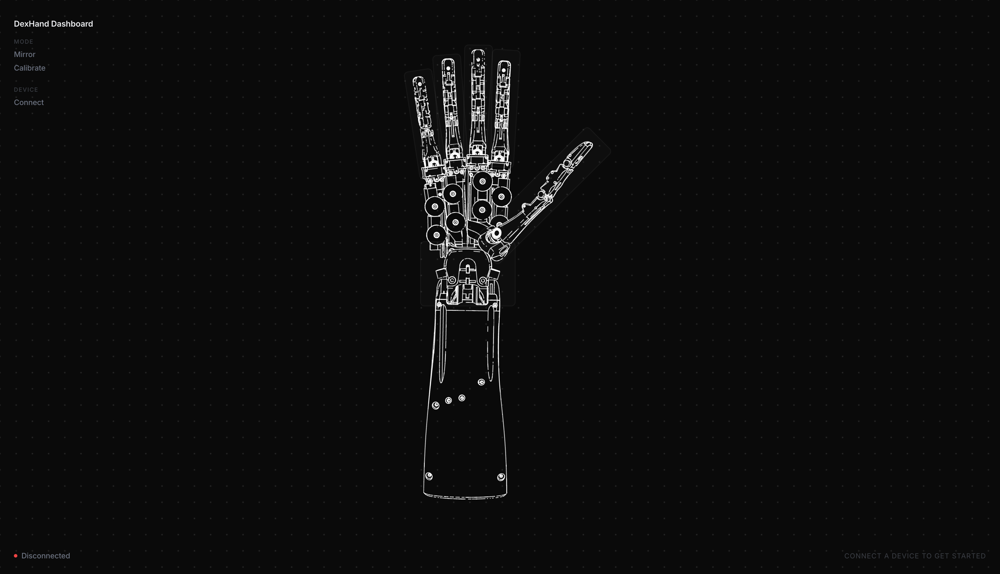
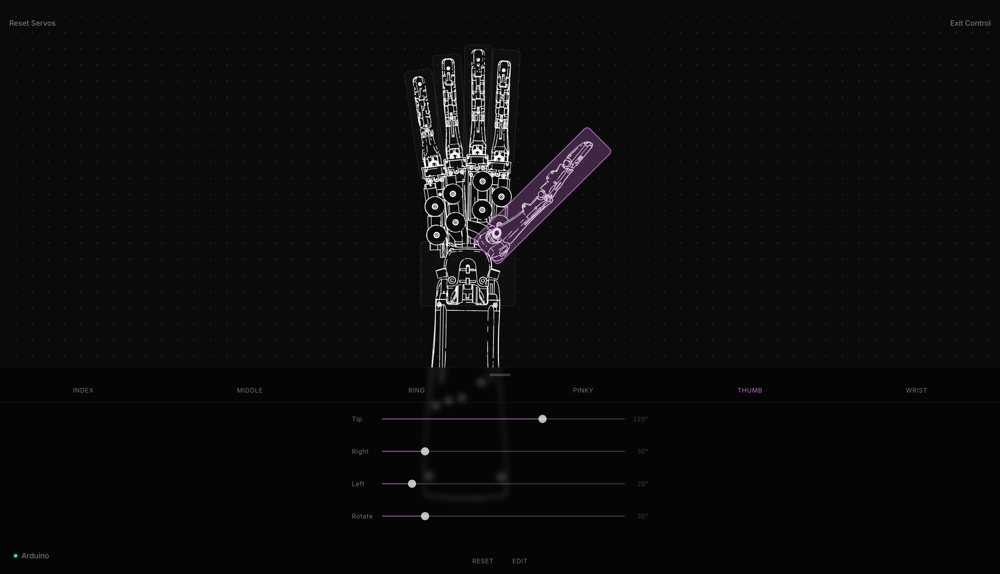
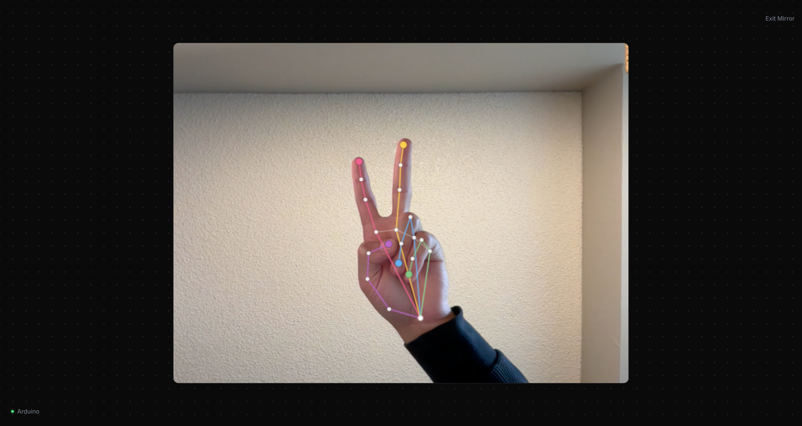

# DexHand Dashboard

A browser-based control dashboard for the [DexHand V1.0](https://github.com/iotdesignshop/dexhand-ble) open-source robotic hand. Connects directly from Chrome via Web Bluetooth and lets you control all 18 servos through a visual interface



---

## Features

**Servo Control** — Click any zone on the hand diagram to open the control panel. Sliders for every joint in that zone, with real-time BLE writes on each change.



**Mirror Mode** — Uses MediaPipe hand tracking via webcam to mirror your hand pose onto the robot in real time. Joint overlay shows what the model is detecting.



---

## Hardware

Built on the [DexHand V1.0](https://github.com/iotdesignshop/dexhand-ble) open-source robotic hand by Rob Knight / IoT Design Shop — 18 servos across fingers, thumb, and wrist, driven by an **Arduino Nano RP2040 Connect**. BLE is handled by the onboard Nina W102 co-processor over Nordic UART Service. The hand needs an external 5V supply at 3–5A.

---

## Stack

- React 18 + Vite
- Web Bluetooth API (Nordic UART Service)
- MediaPipe Tasks Vision (`@mediapipe/tasks-vision`) — GPU delegate, video mode
- Vanilla CSS — no component library

---

## Requirements

** Chrome or Edge (Web Bluetooth is not supported in Safari or Firefox).

```bash
npm install
npm run dev
```

### Firmware

Flash the [dexhand-ble firmware](https://github.com/iotdesignshop/dexhand-ble) to the Arduino Nano RP2040 Connect. The dashboard uses the same Nordic UART Service protocol:

---
